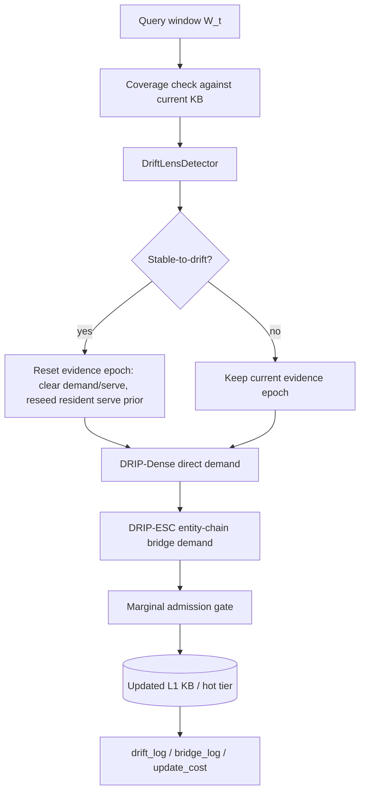
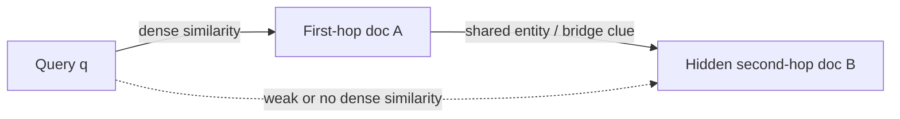
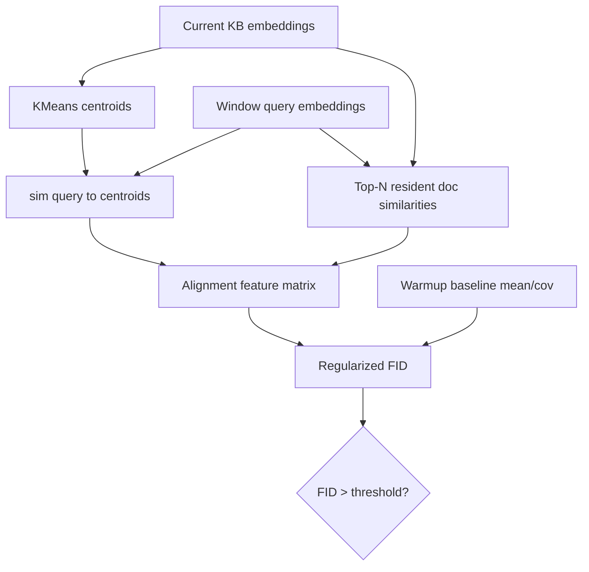
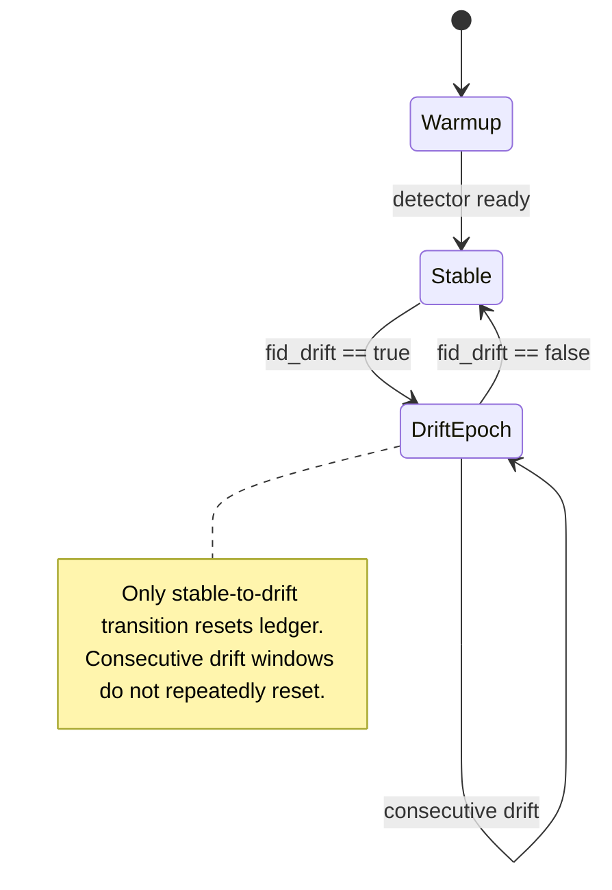

# DRIP Detector and Algorithm Briefing

> 用途：明天汇报时的讲解稿。本文按“问题定义 -> 算法组件 -> detector 当前状态 -> 50-window 结果 -> 下一步修改”的顺序组织，既能解释代码，也能诚实说明当前实验效果。

## 0. 2026-06-21 当前汇报口径

这份 briefing 的旧正文仍保留历史 detector / DRIP-ESC 讨论, 但明天汇报建议以本节为准。
当前代码主线已经收敛为:

```text
DRIP = ESC hidden-support completion + Pair Lease retention
```

不再把 PPR、role rerank、DRF/hubness、Redundancy penalty 作为最终方法主公式。
当前 registry 只保留:

```text
DRIP
DRIP-Dense
DRIP-ESC
DRIP-ESC-Lease
```

### 两条分支

| Branch | 目的 | 当前结论 |
|---|---|---|
| Single-hop query shift | 校准直接可见证据下的 cache 行为 | LRU/FIFO 很强; 这不是 DRIP 主胜场 |
| No-topic-shift multihop | 证明 hidden support cache residency | 这是 DRIP 主胜场: ESC 找 B, Pair Lease 保 A+B |

### Branch A: single-hop query shift

完整实验:

```text
StreamingQA temporal
pool=29,819, KB=400
100 windows x 50 queries
results_streamingqa_temporal_final_clean.json
```

| Strategy | R@5 H1 | R@5 H2 | Writes | MaintR | Cost |
|---|---:|---:|---:|---:|---:|
| ARC | 20.5 | 4.4 | 1083 | 4145 | 5228 |
| FIFO | 50.2 | 32.8 | 2109 | 2907 | 5016 |
| LRU | **52.8** | **33.1** | 2033 | 2843 | 4876 |
| DRIP-Dense | 48.9 | 30.3 | 2261 | 14800 | 17061 |
| DRIP | 48.5 | 29.3 | 2174 | 15010 | 17184 |
| Oracle | 84.4 | 79.4 | 22140 | 0 | 22140 |

讲法:

```text
Single-hop temporal drift is a calibration branch, not the main contribution.
When evidence is directly visible, access-history/recency is already a strong signal.
```

### Branch B: no-topic-shift multihop support completion

完整实验:

```text
static corpus, detector-free
workload=multi_agent_bridge_reuse
KB=750, n_source=3000
20 windows x 25 queries
retrieval=graph
```

| Dataset | Strategy | R@5 H2 | KB Cov H2 | Has-answer | Hidden-B | Reuse | ColdQ | Writes |
|---|---|---:|---:|---:|---:|---:|---:|---:|
| 2Wiki | ARC | 15.4 | 24.9 | 0.2 | 17.9 | 20.8 | 2.884 | 1443 |
| 2Wiki | DRIP-Dense | 19.4 | 25.1 | 3.6 | 4.1 | 5.6 | 2.202 | 649 |
| 2Wiki | DRIP | **19.9** | **31.9** | **4.6** | **23.0** | **35.2** | **2.132** | 785 |
| Hotpot | DRIP-Dense | **67.8** | **68.7** | **59.6** | 35.0 | **70.0** | **0.450** | **523** |
| Hotpot | DRIP | 66.0 | 66.9 | 57.8 | 35.0 | **70.0** | 0.482 | 556 |
| MuSiQue | ARC | 20.3 | 24.5 | 2.4 | 14.6 | 18.8 | 2.080 | 1796 |
| MuSiQue | DRIP-Dense | 23.5 | 26.9 | 5.4 | 13.9 | 22.0 | 1.752 | 819 |
| MuSiQue | DRIP | **24.7** | **30.9** | **6.4** | **15.1** | **23.2** | **1.708** | 823 |

Hotpot caveat:

```text
The current Hotpot workload found almost no shared hidden-B groups (reuse=10).
It is a direct-visible sanity check, not the primary hidden-bridge benchmark.
```

推荐主结论:

```text
DRIP repairs under-covered multi-hop supports:
ESC discovers missing B conditioned on resident/easy A;
Pair Lease keeps A+B resident long enough for future reuse.
```

主公式:

```text
E_ESC(q, B | A) = sim(phi(q,A), B) * link(A,B) * cue(q,B)
D_dir,t(d), D_brg,t(d) = direct and ESC demand ledgers
L_t(A), L_t(B) <- rho L_{t-1} + E_ESC(q,B|A)
P_t(d) = S_t(d) + D_dir,t(d) + D_brg,t(d) + lambda_pair L_t(d)
```

今天不要说:

```text
DRIP solves query shift end to end.
DRIP is a PPR method.
DRIP beats every baseline on every dataset.
```

今天可以说:

```text
DRIP's current validated contribution is no-topic-shift multi-hop cache residency.
Single-hop drift and topic-shift+multihop are separate calibration/extension branches.
```

## 1. 一句话结论

现在的 DRIP 已经形成了一个完整算法闭环：

```text
DRIP-Dense: 负责基础换入换出
DRIP-ESC: 在 DRIP-Dense 上加入 multi-hop bridge evidence
DRIP: 在 DRIP-ESC 上加入 DriftLensDetector 和 adaptive write price
```

当前 detector 的状态可以概括为：

> Detector 是可运行的，也确实检测的是 query-cache alignment drift；但在 50-window 长实验里阈值会收缩到非常小，导致后半段几乎持续报 drift。因此当前问题不是 detector 完全无效，而是 calibration 过敏，导致 drift boolean 的信息量下降。

实验上，DRIP-ESC 的 bridge 组件已经能明显提升 H2；DRIP 当前能显著降低写入成本，但因为 detector/admission 联动偏保守，H2 recall 没有超过 DRIP-ESC。

## 2. 系统总图



DRIP 不是“检测到漂移就固定替换 20% cache”的工程规则。更学术的表述是：

- detector 决定旧 evidence 是否已经失效，也就是是否开启新 epoch；
- weak query 数量给出本窗口的自然写入上限；
- adaptive write price 用在线约束优化的方式控制写入强度；
- candidate/victim 的选择由 demand/serve marginal gain 决定。

## 3. 组件一：DRIP-Dense

代码入口：[algorithms/drip/cache_manager/drip.py](../../algorithms/drip/cache_manager/drip.py)

DRIP-Dense 是最基础的换入换出算法，也是 DRIP-Dense/QD。它维护两个 ledger：

| 变量 | 代码位置 | 含义 |
|---|---|---|
| `demand[d]` | `DRIP-Dense.__init__` | 非 resident 文档或 resident 文档近期被失败 query 需要的证据 |
| `serve[d]` | `DRIP-Dense.__init__` | resident 文档近期实际服务 query 的证据 |
| `serve_prior` | `set_kb` | 初始 KB 的先验保护，避免一开始被过快换掉 |

核心逻辑是：

1. 每个窗口先计算 query 到当前 KB 的最大相似度。
2. `max_s >= SF_HIT_THRESH` 的 query 认为被当前 KB 覆盖，给 best KB doc 加 `serve`。
3. `max_s < SF_HIT_THRESH` 的 query 认为 weak/miss，从 full pool 检索近邻并给候选加 `demand`。
4. resident 文档按 `serve + demand - redundancy_penalty` 排序，低分者是 victim。
5. candidate 只有在边际收益超过当前写入价格时才替换 victim。

代码片段：

```python
# algorithms/drip/cache_manager/drip.py
succ = max_s >= _P.SF_HIT_THRESH
if succ.any():
    best_pos = np.argmax(q_kb[succ], axis=1)
    for pos in best_pos:
        pi = int(kb_idx[pos])
        self.serve[pi] = self.serve.get(pi, 0.0) + 1.0

fail = max_s < _P.SF_HIT_THRESH
fqe = nqe[fail]
pool_sims = fqe @ self.doc_embs.T
```

准入门：

```python
if cval - evict_val[ep] <= write_price:
    break
if _is_dup(cp, kb_emb_now):
    continue
self.kb.discard(self.p2d[ep])
self.kb.add(self.p2d[cp])
```

学术讲法：DRIP-Dense 是一个 demand-ledger online admission policy。它不是 LRU/ARC 那种只利用历史访问频率或 recency 的缓存，而是利用 query failure 反向估计“哪些 cold documents 会提升未来覆盖率”。

## 4. 组件二：DRIP-ESC

代码入口：[algorithms/drip/cache_manager/support_completion.py](../../algorithms/drip/cache_manager/support_completion.py)

DRIP-ESC 是我们针对 multi-hop bridge 场景加的组件。它解决的问题是：在 bridge question 里，query 往往只和第一跳文档 `A` 相似，但真正缺失的是第二跳文档 `B`。



DRIP-ESC 的做法：

1. 对 weak query 从 full pool 找 top step-1 docs，作为可能的 `A`。
2. 读取这些 `A` 的实体。
3. 用 entity inverted index 找共享实体的候选 `B`。
4. 用 first-hop 相似度和实体 IDF 给 `B` 加 bridge demand。
5. `B` 不直接进 cache，而是进入和 DRIP-Dense 相同的 demand ledger，和所有 candidate 公平竞争。

代码片段：

```python
# algorithms/drip/cache_manager/support_completion.py
for e, ew in ent_weight.items():
    for bj in self._ent_index.get(e, ()):  # pool idx
        if bj not in a_set:
            bridge_score[bj] += ew

ranked = sorted(bridge_score.items(), key=lambda x: -x[1])
for bj, ov in ranked[:self.config.r3_max_bridge]:
    score = self.config.r3_alpha * float(ov / norm)
    self.demand[bj] = self.demand.get(bj, 0.0) + score
```

学术讲法：DRIP-ESC 是一个 entity-chained bridge admission signal。它不是 retrieval-time reranking，而是 write-side proactive admission：把未来可能被多跳推理需要的 second-hop support document 提前写入 hot tier。

## 5. 组件三：DriftLensDetector

Detector 代码入口：[algorithms/drip/detection/drift_detector.py](../../algorithms/drip/detection/drift_detector.py)

DRIP 里 detector 的关键设计是：

> 不检测 raw query embedding 变没变，而检测 query 与当前 KB 的对齐模式变没变。

原因是 raw query drift 不一定需要更新 cache。新 query 可能语义分布变了，但当前 KB 仍然覆盖它；相反，只有 query-cache alignment 变差时，cache 才真的需要更新。

### 5.1 对齐特征

对每个 query `q`，detector 构造：

```text
alignment_features(q, KB) = [
  sim(q, centroid_1), ..., sim(q, centroid_K),
  top1_sim(q, KB), ..., topN_sim(q, KB)
]
```

图示：



对应代码：

```python
# algorithms/drip/detection/drift_detector.py
centroid_sims = query_embs @ self._kb_centroids.T
all_doc_sims = query_embs @ self._kb_embeddings.T
topn_sims = np.take_along_axis(all_doc_sims, idx, axis=1)
alignment_features = np.concatenate([centroid_sims, topn_sims], axis=1)
```

### 5.2 FID 检测

Warmup 阶段：

1. 对当前 KB embedding 做 KMeans，得到主题中心。
2. 将历史 query 映射到 alignment feature space。
3. 计算 baseline mean/cov。
4. bootstrap 历史窗口的 FID 分数，取 P95 作为阈值。

Online 阶段：

1. 当前窗口 query 计算 alignment feature。
2. 计算窗口分布与 baseline 分布的 regularized FID。
3. `FID > threshold` 判为 alignment drift。

代码片段：

```python
# algorithms/drip/detection/drift_detector.py
fid = self._regularized_fid(
    self._baseline_mean, self._baseline_cov, mu_w, cov_w
)
is_drifted = fid > self.threshold
return DriftResult(fid_score=fid, threshold=self.threshold, is_drifted=is_drifted)
```

FID 公式：

```text
FID = ||mu_0 - mu_t||^2 + Tr(Sigma_0 + Sigma_t - 2 * sqrt(Sigma_0 Sigma_t))
```

实现里对 covariance 加了 `eps * I`，避免小窗口下协方差矩阵奇异。

## 6. DRIP 如何使用 detector

DRIP 主代码入口：[algorithms/drip/cache_manager/drip.py](../../algorithms/drip/cache_manager/drip.py)

Detector 在 DRIP 中不是直接决定“换多少”，而是决定是否开启新 evidence epoch。



关键代码：

```python
# algorithms/drip/cache_manager/drip.py
drift_event = fid_drift is True and not self._in_drift
if drift_event:
    self._epoch += 1
    self._reset_epoch_ledger()

if fid_drift is True:
    self._in_drift = True
elif fid_drift is False:
    self._in_drift = False
```

写入预算和写入价格：

```python
write_budget = min(n_weak, _P.WRITE_CAP)
self._write_budget = write_budget
super().step(window_queries, window_query_embs, window_idx)
writes = self.update_cost - prev_writes

target_writes = self.config.write_target_rate * write_budget
self._write_price = max(
    0.0,
    self._write_price + self.config.write_price_eta * (writes - target_writes),
)
```

这段可以讲成一个在线 primal-dual 写入约束：

```text
budget_t = min(#weak_queries_t, WRITE_CAP)
lambda_{t+1} = max(0, lambda_t + eta * (writes_t - rho * budget_t))
admit c over e iff score(c) - score(e) > lambda_t
```

直觉：

- 写太多，`lambda_t` 上升，后续更难写。
- 写太少，`lambda_t` 下降，后续更容易写。
- 因此不需要手写 mild/aggressive ratio。

## 7. DRIP 伪代码

```python
def DRIP_STEP(window_queries, window_query_embs, KB, pool, state):
    # 1. Coverage and weak-query budget
    q = normalize(window_query_embs)
    kb_emb = embeddings(KB)
    max_sim = max_similarity(q, kb_emb)
    weak = max_sim < hit_threshold
    write_budget = min(count(weak), WRITE_CAP)

    # 2. Query-cache alignment drift detection
    state.query_history.append(q)
    if state.detector_not_ready and state.window >= warmup_windows:
        state.detector.set_baseline(kb_emb, state.query_history)
        state.detector.calibrate_threshold(state.query_history)

    if state.detector_ready:
        fid, threshold, drifted = state.detector.detect(q)
    else:
        drifted = None

    # 3. Evidence epoching
    if drifted is True and state.in_drift is False:
        state.epoch += 1
        state.demand.clear()
        state.serve = {d: serve_prior for d in KB}
    state.in_drift = (drifted is True)

    # 4. Shared demand/serve ledger
    decay(state.demand)
    decay(state.serve)
    for query in window_queries:
        if covered_by_KB(query):
            state.serve[best_KB_doc(query)] += 1
        else:
            for d in topk_dense_pool_docs(query):
                state.demand[d] += dense_demand(query, d)
            for b in entity_chained_bridge_docs(query):
                state.demand[b] += bridge_demand(query, b)

    # 5. Marginal admission
    candidates = sort_nonresident_by_demand(state.demand)
    victims = sort_residents_by_low_value(KB, state.serve, state.demand)
    writes = 0
    for c, e in pair(candidates, victims):
        if writes >= write_budget:
            break
        if score(c) - score(e) <= state.write_price:
            break
        if near_duplicate(c, KB):
            continue
        KB.replace(e, c)
        writes += 1

    # 6. Adaptive write-price update
    target = write_target_rate * write_budget
    state.write_price = max(0, state.write_price + eta * (writes - target))
    return KB
```

## 8. Detector 现在准不准

### 8.1 已经成立的部分

Detector 现在的功能是完整的：

- 有 warmup baseline；
- 有 query-cache alignment feature；
- 有 regularized FID；
- 有 bootstrap percentile threshold；
- 有 `DriftResult(fid_score, threshold, is_drifted)`；
- 有 detector 单测，`python -m algorithms.drip.tests.test_2_drift_detector` 通过。

在合成或短程场景里，它能够识别 alignment distribution 的变化。

### 8.2 当前暴露的问题

50-window 真实长程实验中，阈值会不断收缩：

| 设置 | windows | drift true | epoch reset | DRIP writes | threshold early/mid/last |
|---|---:|---:|---:|---:|---|
| KB=4700 | 50 | 43 | 3 | 319 | 0.0010 / 0.0002 / 0.0001 |
| KB=1050 | 50 | 47 | 1 | 575 | 0.0014 / 0.0003 / 0.0001 |

这说明 detector 当前过敏：后半段 `FID > threshold` 几乎一直成立。DRIP 用 `_in_drift` 只在 stable-to-drift 边界 reset，所以不会每个窗口重复清空 ledger；但当 `fid_drift` 长期为 true 时，detector boolean 本身就不再能区分“刚发生漂移”和“已经处在新稳定区域”。

因此，当前 detector 的评价应当是：

```text
能检测 alignment mismatch，但 threshold calibration 还不够稳。
它作为 epoch trigger 可用，但作为连续状态信号还不够准。
```

### 8.3 为什么会这样

主要原因有三个：

1. baseline 会在 KB 写入后重建，而 recent history 可能过短或过窄，使 bootstrap FID 分布非常小，P95 阈值趋近 0。
2. alignment feature 维度不高，但 window size 也小，FID 对均值和协方差的轻微变化敏感。
3. sudden drift 后长期处于新域，若 baseline 没有稳定吸收新域，detector 会把“新稳定状态”也持续报成 drift。

### 8.4 下一版 detector 建议

可以把 detector 从“单阈值报警器”升级为“带滞后和冷却的 change-point detector”：

| 修改 | 作用 | 学术表述 |
|---|---|---|
| threshold floor | 防止 bootstrap 阈值塌缩到 0 | lower-bounded empirical quantile threshold |
| consecutive drift gate | 连续 M 个窗口超阈值才触发 epoch | hysteresis / persistence gate |
| rebuild cooldown | 避免频繁重建 baseline 后阈值不稳定 | refractory period after adaptation |
| ratio score | 用 `FID / threshold` 作为强度，而非只用 boolean | normalized drift severity |
| stationary false positive test | 用 stationary stream 测误报率 | calibration under null distribution |

推荐明天讲的时候说：

> 当前 detector 证明了 alignment-feature FID 这条路能跑通，但 long-horizon calibration 暴露出假阳性偏高。下一版我们会把它改成带 threshold floor、consecutive-window confirmation 和 cooldown 的 change-point detector。

## 9. 50-window 实验结果

### 9.0 结果文件和一页总结图

当前最重要的结果文件有三类：

| 场景 | 结果文件 | 用途 |
|---|---|---|
| StreamingQA temporal, DRIP final | [experiments/direct/data/results_streamingqa_temporal_drip_final.json](../../experiments/direct/data/results_streamingqa_temporal_drip_final.json) | 展示 DRIP/DRIP-Dense 在真实时间漂移上的恢复能力 |
| StreamingQA temporal, ARC/FIFO/LRU | [experiments/direct/data/results_streamingqa_temporal_100w_arc_fifo_lru.json](../../experiments/direct/data/results_streamingqa_temporal_100w_arc_fifo_lru.json) | 解释 ARC 在 temporal 场景为什么失效 |
| 2Wiki bridge-comparison | [experiments/hidden/data/results_50w_2wiki_bridge_dual_drip.json](../../experiments/hidden/data/results_50w_2wiki_bridge_dual_drip.json) | 展示 DRIP-Dense/DRIP-ESC/DRIP/ARC 在多跳 bridge 上的差异 |

已经生成了一张明天可以直接讲的 summary figure：

- PNG：[motivation/paper_figs/experiments/fig_drip_arc_summary.png](../../motivation/paper_figs/experiments/fig_drip_arc_summary.png)
- PDF：[motivation/paper_figs/experiments/fig_drip_arc_summary.pdf](../../motivation/paper_figs/experiments/fig_drip_arc_summary.pdf)
- 绘图脚本：[motivation/plotting/plot_drip_arc_summary.py](../../motivation/plotting/plot_drip_arc_summary.py)

这张图分三块：

1. 左侧：StreamingQA temporal 的 per-window `Recall@5` 曲线，展示 ARC 在时代切换后恢复弱，而 DRIP-Dense/DRIP 能随 query failure 补新知识。
2. 右上：StreamingQA temporal 的 `R@5 H2`、`Coverage H2` 和总写入数。
3. 右下：2Wiki bridge-comparison 的 `R@5 H2`、`Coverage H2` 和总写入数，展示 DRIP-ESC 的 bridge signal。

### 9.1 评价指标

| 指标 | 含义 | 为什么重要 |
|---|---|---|
| `Recall@k` | 对每个 query，从当前 hot KB 检索 top-k，是否命中 gold support 文档 | 直接衡量 RAG 的检索可用性 |
| `Recall@k_h1` | drift 前半段或旧域的 recall | 看旧知识是否保住 |
| `Recall@k_h2` | drift 后半段或新域的 recall | 看算法能否适应新需求，是当前最关键指标 |
| `KB Coverage` / `cov_h2` | gold support 是否存在于当前 hot KB 中，不考虑排序 | 衡量 cache 内容本身是否包含答案证据 |
| `Update cost` / `Writes` | cache 替换写入次数 | 衡量维护成本和系统扰动 |
| `Maintenance retrieval cost` | 为了更新 cache 额外查 full pool 的次数 | 衡量后台维护开销 |
| `Total cost` | update cost + maintenance retrieval cost 等 | 综合成本，但不同实验里解释要看具体 cost 定义 |

汇报时建议主打三列：

```text
R@5 H2      新域检索质量
Coverage H2 新域 hot KB 内容质量
Writes      为达到该质量付出的更新成本
```

原因：我们做的是漂移和多跳场景，H2 才是算法真正需要适应的部分；H1 高通常只是说明初始 KB 对旧域覆盖好。

实验命令一：自动 KB budget，实际 `KB=4700`。

```bash
/home/jyliu/miniconda3/envs/ljy_rag_ft/bin/python experiments/hidden/run.py \
  --n-windows 50 --window-size 25 \
  --expanded --datasets 2wikimultihopqa \
  --q-type bridge_comparison --n-source 2000 --n-stream-queries 1250 \
  --strategies DRIP-Dense DRIP-ESC DRIP AgentRAGCache Oracle \
  --retrieval entity_expand \
  --output results_50w_2wiki_bridge_dual_drip.json
```

结果文件：[experiments/hidden/data/results_50w_2wiki_bridge_dual_drip.json](../../experiments/hidden/data/results_50w_2wiki_bridge_dual_drip.json)

| Method | R@5 H1 | R@5 H2 | KB Cov H2 | Writes |
|---|---:|---:|---:|---:|
| DRIP-Dense | 56.1 | 8.4 | 33.7 | 1431 |
| DRIP-ESC | 56.0 | 15.3 | 38.4 | 2994 |
| DRIP | 56.1 | 7.9 | 34.3 | 319 |
| AgentRAGCache | 48.7 | 17.8 | 45.6 | 2811 |
| Oracle | 57.4 | 56.4 | 100.0 | 25763 |

读法：

- `DRIP-ESC > DRIP-Dense` on H2：bridge evidence 是有效的，H2 从 8.4 提到 15.3。
- `DRIP writes` 很低：319，相比 DRIP-ESC 的 2994 少很多。
- 但 DRIP H2 只有 7.9，说明当前 detector + adaptive write price 组合过保守，省写入省过头了。
- Oracle 很高，说明不是数据没法做，而是 admission signal / detector calibration 还有提升空间。

实验命令二：固定小 KB，`KB=1050`。

```bash
/home/jyliu/miniconda3/envs/ljy_rag_ft/bin/python experiments/hidden/run.py \
  --n-windows 50 --window-size 25 \
  --expanded --datasets 2wikimultihopqa \
  --q-type bridge_comparison --n-source 2000 --n-stream-queries 1250 \
  --kb-budget 1050 \
  --strategies DRIP-Dense DRIP-ESC DRIP AgentRAGCache Oracle \
  --retrieval entity_expand \
  --output results_50w_2wiki_bridge_dual_drip_kb1050.json
```

结果文件：[experiments/hidden/data/results_50w_2wiki_bridge_dual_drip_kb1050.json](../../experiments/hidden/data/results_50w_2wiki_bridge_dual_drip_kb1050.json)

| Method | R@5 H1 | R@5 H2 | KB Cov H2 | Writes |
|---|---:|---:|---:|---:|
| DRIP-Dense | 9.3 | 1.7 | 4.9 | 2176 |
| DRIP-ESC | 9.0 | 2.8 | 5.2 | 2696 |
| DRIP | 10.7 | 1.3 | 6.9 | 575 |
| AgentRAGCache | 4.2 | 2.0 | 9.4 | 2806 |
| Oracle | 65.2 | 65.6 | 100.0 | 13054 |

读法：

- 小 KB 下所有非 Oracle 都很低，容量压力非常大。
- DRIP-ESC 仍然比 DRIP-Dense 的 H2 更好，说明 bridge signal 方向对。
- DRIP 写入显著更少，但 H2 没起来，说明当前版本更像“低写入保守策略”，还不是最终最优策略。

## 10. 明天汇报建议讲法

可以按这四句话组织：

1. 我们现在的算法不是普通 LRU/ARC，而是 query-demand-driven 的 proactive hot-tier cache。
2. DRIP-Dense 解决“query miss 后该换入哪些直接相关文档”；DRIP-ESC 解决“多跳 bridge 的第二跳文档 query 本身看不到”的问题。
3. DriftLensDetector 不检测 query embedding drift，而检测 query-cache alignment drift；drift 只表示旧 evidence 失效，所以触发 epoch reset，不直接绑定固定替换比例。
4. 当前实验说明 bridge admission 是有效的，但 detector calibration 在长程场景过敏，DRIP 为了控写入牺牲了 H2；下一步要做的是把 detector 改成带 threshold floor、连续确认和 cooldown 的 change-point detector，并重新平衡 write price。

## 10.1 我们和 ARC 的最大区别

ARC / AgentRAGCache 和我们最根本的区别不是“谁也用了 query”，而是 query 信号的用途不同：

| 维度 | ARC / AgentRAGCache | 我们的 DRIP-Dense/Routed/DRIP |
|---|---|---|
| 核心目标 | 维护一个 compact per-agent corpus | 维护 drift-aware L1 document hot tier |
| 主要信号 | DRF/rank-frequency + hubness，偏历史访问价值 | query failure -> demand ledger，偏未来需求缺口 |
| 换入来源 | 更像围绕已访问/高频/中心文档做压缩 | 从 full pool 主动找能修复 miss 的 candidate |
| 漂移处理 | 没有显式 query-cache alignment detector | detector 识别 alignment drift，触发 evidence epoch |
| 多跳 bridge | query 看不到第二跳时容易缺信号 | entity-chained bridge evidence 给第二跳文档加 demand |
| 写入控制 | priority/eviction 风格 | weak-query budget + marginal gain + adaptive write price |

一句话：

> ARC 更像“把过去对 agent 有用的文档压缩保存下来”，而我们的算法更像“根据当前 query failure 主动把未来会需要的证据写进 hot tier”。

## 10.2 ARC 为什么在 temporal 场景无效

StreamingQA temporal 的数据有真实时间段切换：旧时代问题和新时代问题需要的 support documents 不一样。ARC 在这个场景上失败，主要有四个原因：

1. **历史频率变成错误先验**：ARC 的 DRF/rank-frequency 会保护过去频繁命中的文档，但 temporal drift 后这些旧文档对新 query 不再有用。
2. **hubness 会偏向通用旧文档**：hub 文档在 embedding 空间里很中心，容易被保留；但 temporal QA 需要的是某个时间段的新事实，不一定是中心文档。
3. **没有显式 drift 边界**：时代切换时，ARC 不会清空旧 evidence，也不会知道旧统计已经失效。
4. **缺少 miss-driven admission**：新 query miss 以后，ARC 没有像 DRIP-Dense 一样把 full pool 中能修复 miss 的新文档系统性加到 demand ledger。

结果上，StreamingQA temporal 里：

| Method | R@5 H2 | Coverage H2 | Writes |
|---|---:|---:|---:|
| ARC | 4.4 | 4.2 | 1083 |
| DRIP-Dense | 30.3 | 31.4 | 2261 |
| DRIP | 29.3 | 30.6 | 2174 |
| LRU | 33.0 | 35.2 | 2032 |
| Oracle | 79.4 | 100.0 | 22140 |

这里 LRU 也很强，说明 temporal drift 里 recency 是天然强信号；ARC 反而被 history/hubness 拖住了。我们的优势是更通用：在没有显式 timestamp 的情况下，仍能通过 query failure 做主动补库；但 temporal-only 场景里，最好把 recency/time signal 作为额外强 baseline 或混合信号一起比较。

## 11. 下一步代码修改清单

最建议优先做这几项：

| 优先级 | 修改 | 文件 |
|---|---|---|
| P0 | 给 `DriftLensDetector` 加 `min_fid_threshold`，阈值取 `max(empirical_p95, floor)` | `algorithms/drip/detection/drift_detector.py` |
| P0 | DRIP 里加 `drift_confirm_windows`，连续 M 个 drift 才 epoch reset | `algorithms/drip/cache_manager/drip.py` |
| P0 | 加 `rebuild_cooldown_windows`，避免 baseline 频繁重建 | `algorithms/drip/cache_manager/drip.py` |
| P1 | `drift_log` 记录 `fid_ratio = fid / threshold` | `algorithms/drip/cache_manager/drip.py` |
| P1 | 写 stationary false-positive detector test | `algorithms/drip/tests/test_2_drift_detector.py` |
| P1 | 调低 `write_price_eta` 或提高 `write_target_rate` 做 H2 恢复实验 | `algorithms/drip/cache_manager/config.py` |

预期变化：

- detector 的 `drift_true` 数量下降；
- epoch reset 更少但更准确；
- DRIP 写入会比现在多一些，但应仍低于 DRIP-ESC；
- H2 recall 应该向 DRIP-ESC 靠近，理想情况是在相近或更少写入下超过 DRIP-Dense。

## 12. 最终定位

当前最稳的论文定位是：

> DRIP is a drift-aware, multi-hop-sensitive L1 document cache for Agent RAG. It combines query-demand admission, entity-chained bridge evidence, and query-cache alignment change-point detection to maintain a bounded hot tier under workload shift.

不要把现在版本包装成“agent memory 系统”，也不要说 detector 已经完全解决所有 drift。更好的讲法是：

> 我们已经把算法拆成了三个可消融组件。当前实验证明 multi-hop bridge signal 有收益，drift detector 的思想可运行，但长程校准需要加强。这给下一版改进提供了非常清楚的方向。
